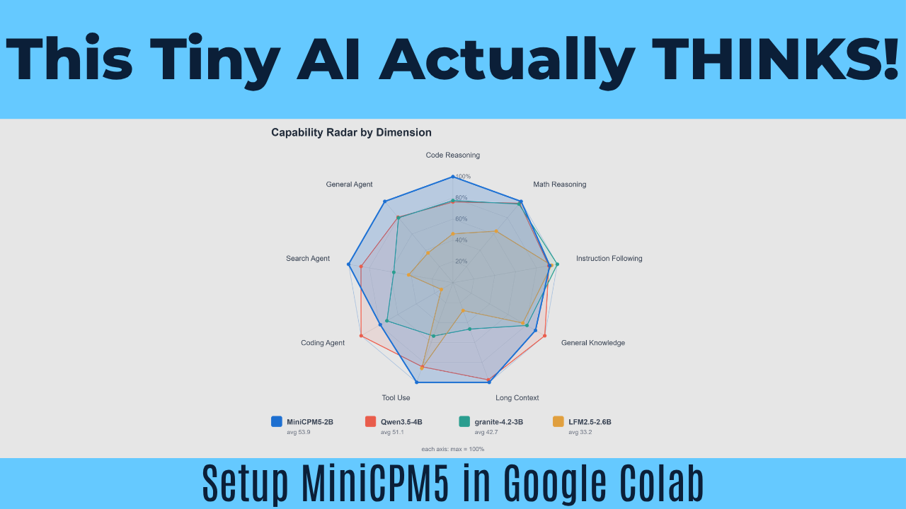

# ⚡ MiniCPM5 in Google Colab

This repository contains a simple, interactive Google Colab notebook for running the **MiniCPM5** language models. You can instantly chat, generate text, and test the model's advanced reasoning ("thinking") features directly in your browser using a free T4 GPU.

**🎥 Watch the Tutorial:** [Setup MiniCPM5 in Google Colab](https://www.youtube.com/watch?v=kQlceXGX_Vs)

**🚀 Run in Colab:** [Open Google Colab Notebook](https://colab.research.google.com/drive/1T9PfAU-PagYdyoZDCfXEfxhxs2Od6RJP?usp=sharing)

---

## ✨ Features Supported in this Notebook

This notebook makes it easy to run MiniCPM5 without complex coding. It is divided into 3 automated steps:

1. **⚙️ Initialize Core Environment**: Installs the required libraries, including `transformers` and `accelerate`.
2. **📥 Download and Load Model**: 
   * Choose between the lightweight `MiniCPM5-1B` or the more powerful `MiniCPM5-2B` model.
   * Automatically handles `fp16` optimization so it runs smoothly on older GPUs like the Colab T4.
3. **💬 MiniCPM5 Text Generation**: 
   * **Custom Prompts:** Ask the AI anything.
   * **Thinking Mode:** Toggle the `USE_THINKING` box to enable the model's advanced reasoning engine.
   * **Advanced Settings:** Easily tweak `MAX_NEW_TOKENS`, `REPETITION_PENALTY`, and `TEMPERATURE` using simple sliders. 

## 🛠️ How to Use

1. Click the "Open in Colab" badge above.
2. Go to **Runtime > Change runtime type** in the top menu and ensure a **T4 GPU** is selected.
3. Run **Cell 1** to install the required environment packages.
4. Go to **Cell 2**, select either the 1B or 2B model from the dropdown, and hit the play button. This will download the model into the GPU memory (this takes a few minutes on the first run).
5. Go to **Cell 3**. Type your question in the `PROMPT` box, choose if you want the AI to "think" first, and click play. The AI will generate your text right below the cell! You can run this 3rd cell as many times as you want without reloading the model.

## 🤝 Credits
* **Notebook Creator:** [@CoinNoin](https://www.youtube.com/@CoinNoin)
* **Base AI Model:** [OpenBMB / MiniCPM5](https://huggingface.co/collections/openbmb/minicpm5)
